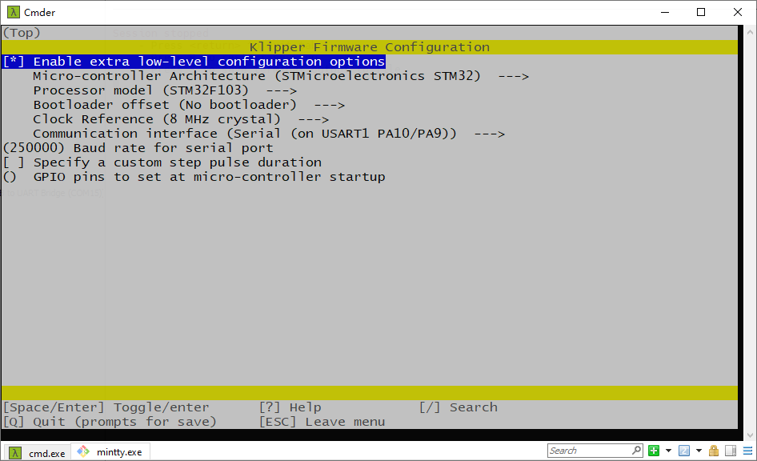
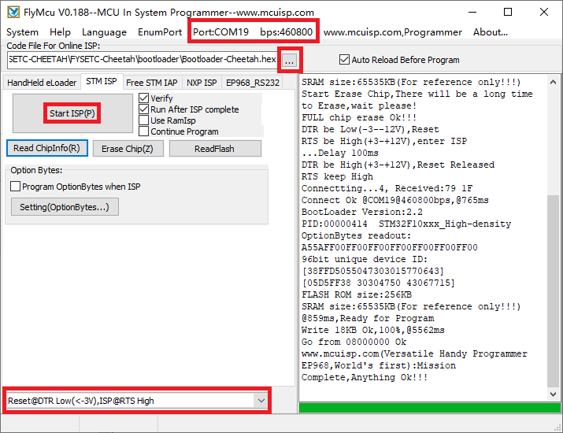

# Firmware&OS

## 1. Firmware

We use `Cheetah v1.2` motherboard ([github](https://github.com/FYSETC/FYSETC-Cheetah)) for our `Voron-0` kit. And we use `Klipper` firmware. You can get the pre-build firmwares and `printer.cfg` files beside this `README` file.  In the kit you should find an sdcard with octopi system flashed. After you build your Voron 0.1 machine, you can insert it to the raspberrypi and power up the machine, the machine should work. Remember to connect ethernet cable to raspberrypi and connect Cheetah board to raspberrypi with USB cable.  

### 1.1 Klipper compile

We use the following `make menuconfig` below to compile Klipper. You can check more firmware build information in our Cheetah board github page [here](https://github.com/FYSETC/FYSETC-Cheetah#klipper).



### 1.2 How to flash 

Well, i don't recommend you to use our pre-build firmwares as klipper firmware always update. I recommend you to compile klipper yours, follow it [here](https://www.klipper3d.org/Installation.html). The prebuild firmwares below just for beginners.

You should power up Cheetah board with 12v/24v power supply first.

#### klipper.bin

If you use our pre-build `klipper.bin` firmware, you can flash the firmware with the command below. This command is also for those who compile klipper yourself, but you need to `cd ~/klpper/out` first. Remember to connect RaspberryPi with usb cable to Cheetah.

```
stm32flash -w klipper.bin -v -i rts,-dtr,dtr /dev/ttyUSB0
```

#### klipper.hex

This is our pre-build firmware in hex format, you can flash it in windows system. 

You can follow the following steps to upload the bootloader.

- Download the flash software in our github https://github.com/FYSETC/STM32Flasher
- Power the board with power supply and connect the board to your PC with USB cable
- Double the click "FlyMcu.exe" software

[](https://github.com/FYSETC/FYSETC-Cheetah/blob/master/images/Flymcu.png)

- Select `Reset@DTR low(<-3v),ISP @RTS High`
- Click "Port" to select the port of your USB
- Select `Bootloader-STM32F103.hex` in the `Code File For Online ISP:` edit box. There is bootloader file named `Bootloader-STM32F103.hex` beside this `README` file.
- At last, click `Start ISP(p)` button to upload the firmware.

### 1.3 printer.cfg

We provide you an example `printer.cfg` beside this `README` file.

## 2. Octopi OS

In the kit, you should find an sdcard pre-flashed Octopi system. We also provide you this Octopi system image for you. If your kit version is rev1.0, then your cheetah board version is 1.2, you can get the responding Octopi system here([1.Dropbox](https://www.dropbox.com/s/o599ni65a6fd2by/voron0.1-cheetah1.2-octopi0.18-octoprint1.6.1-klipper-final.img?dl=0) [2.百度云盘](https://pan.baidu.com/s/1epDDUFP4t6gNax9Bxs07-w) 提取码：1357) . If your kit version is rev1.1, then your cheetah board version is 2.0, and you can get the responding Octopi system here([1.Dropbox](https://www.dropbox.com/s/smtbososhue4zym/voron0.1-cheetah2.0-octopi0.18-octoprint1.7.2-klipper.img?dl=0) [2.百度云盘](https://pan.baidu.com/s/12OQ6AqPryXO6TYDF16cSlw ) 提取码：YYDS).

### 2.1 how to flash

Before flash, you need an SD card , minimum requirement of SD card capacity is 8G. Please prepare that first. And then you can use this software [here](https://www.balena.io/etcher/) to install. Well that are so many OS flash tool that you can use. And there are a lot of tutorial if you google `how to flash os image`.

## 3. V0_Display

If you want to install V0_Display to the machine, you should update its firmware first. Please follow `README` in [github](https://gitee.com/fysetc/Voron-Hardware/blob/master/V0_Display/Documentation/Setup_and_Flashing_Guide.md) or [gitee](https://github.com/VoronDesign/Voron-Hardware/blob/master/V0_Display/Documentation/Setup_and_Flashing_Guide.md).
