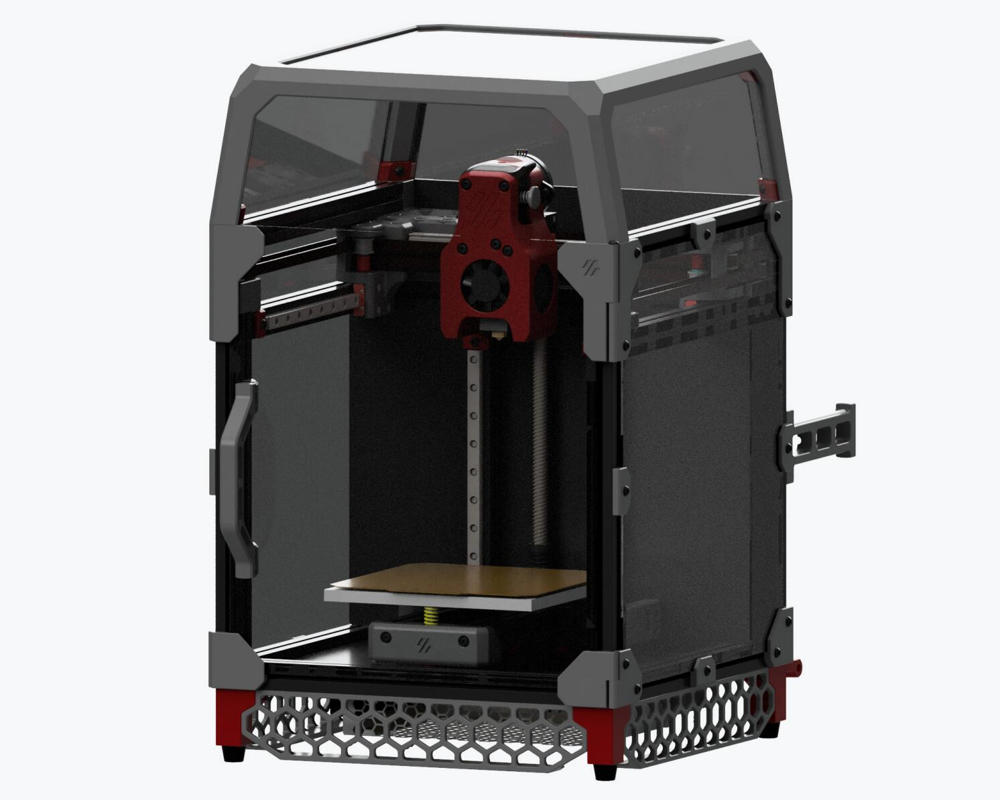

# FYSETC-Voron-0.1
This is a project from the VORON community, VORON 0.1. We made a little upgrade and improvement on the basis of this project, and provided a complete set of information. Thanks to the open source materials and support provided by the VORON community, and hope you like it. You can find Voron official information below.

1.VORON 0.1 Official website：https://vorondesign.com/voron0.1

2.VORON 0.1 Official Github：https://github.com/VoronDesign/Voron-0



## 1. Kit advantages:

1）Using a fully enclosed cabinet design, high-precision finishing anodized custom profile frame, exquisite appearance, can support printing high-temperature consumables, such as: ABS, PC, etc.

2）Print surface: high-quality powder PEI steel plate, good adhesion, flexibility, easy to take molds; platform: MIC6 aluminum finishing, flatness up to 0.05, attached to high-temperature soft magnetic, and additionally designed positioning pillars, which can be fast Place the steel plate in place and not easily move.

3）We use 150W genuine brand new Meanwell power supply, which can provide a stable and reliable energy source for the machine and make the machine run more stable. The Raspberry Pi uses TOBSUN 5V 10A DC module for power supply. In addition to providing reliable power for the Raspberry Pi, it also facilitates your other power supply needs, such as cool light strips.

4）Tornado hotend, check the features [here](https://github.com/FYSETC/FYSETC-Voron-0/blob/main/Tornado_hotend.md). (Please installation guide on our [youtube](https://www.youtube.com/watch?v=a5HArBp4h3s))

5）Provide a complete set of crimped terminal wires, suitable in length, plug and play, and easy to use.

6）It adopts high-precision anti-rust linear guide, precise position and stable operation

7）Using gates belt, wear-resistant, non-slip, long life.

8）The door handle is fixed with screws, which is more firm and reliable.

9）Imported silicone thermal mattress, high temperature resistance, built-in over-temperature fuse, high power 24V 75W, fast heating.

10）High-quality motors.

11）The use of a 3:1 reduction ratio extruder can increase the extrusion force of the large distance, ensure the smooth and effective extrusion of the consumables, and improve the printing quality.

12）Use Klipper firmware
Running on [Cheetah V1.2b](https://github.com/FYSETC/FYSETC-Cheetah) (On kit rev 1.0) or [Cheetah v2.0](https://github.com/FYSETC/FYSETC-Cheetah-v2) (On kit rev1.1) and Raspberry Pi 3B+, it can achieve higher printing speed, provide Web control (via WiFi or Ethernet), can connect to a camera, and can be equipped with a 12864 display screen.

## 2. BOM

Check [here](https://github.com/FYSETC/FYSETC-Voron-0/blob/main/BOM.md).

## 3. Modified STLs (2021.07.22)

We update some STLs for the kit. As we found the following issues during the test that 

1.`[a]_Cowling_dragon_x1.stl` fan is difficult to install; 

2.`[a]Mid_Body_Dragon_x1.stl` feed hole is too small; 

3.`Strain_Relief_Spacers_x2.stl` motor uses 20 height; 

4.`Door_Handle_x1 handle.stl` The glue won't stick.

So we modify these STLs base on the originals. You can find them in our `github` or `gitee`.

`[a]_Cowling_dragon_x1.stl` : [github](https://github.com/FYSETC/FYSETC-Voron-0/blob/main/STLs/Toolheads/Mini_Afterburner/Dragon_Toolhead_DD/%5Ba%5D_Cowling_dragon_x1.stl)

`[a]Mid_Body_Dragon_x1.stl`: [github](https://github.com/FYSETC/FYSETC-Voron-0/blob/main/STLs/Toolheads/Mini_Afterburner/Dragon_Toolhead_DD/%5Ba%5D_Mid_Body_Dragon_x1.STL)

`Strain_Relief_Spacers_x2.stl` : [github](https://github.com/FYSETC/FYSETC-Voron-0/blob/main/STLs/Toolheads/Mini_Afterburner/Strain_Relief_Spacers_x2.STL)

`Door_Handle_x1.stl`: [github](https://github.com/FYSETC/FYSETC-Voron-0/blob/main/STLs/Panel_Mounting/Door_Handle_x1.STL)

You can also download these STL files in our `thingiverse` [here](https://www.thingiverse.com/thing:4914152).

## 4. Installation Guide

### 4.1 VORON Assembly manual

Check it [here](https://github.com/VoronDesign/Voron-0/blob/Voron0.1/Manuals/Assembly_Manual_0.1.pdf).

### 4.2 Tornado Hotend installation

Please check it on our [youtube](https://www.youtube.com/watch?v=a5HArBp4h3s).

## 5. Wiring

### 5.1 Rev1.0 kit

Following is our Cheetah v1.2 board wiring diagram for VORON 0.1 rev1.0 kit.


We make an example wiring for you, but i think you can do a better job than us. Looking forward to yours, you can share it on VORON discord.


### 5.2 Rev1.1 kit

Following is our Cheetah v2.0 board wiring diagram for VORON 0.1 rev1.1 kit.


## 6. Firmware&OS

You can check firmware `README.md` in `Firmware&OS` folder beside this `README.md` file [here](https://github.com/FYSETC/FYSETC-Voron-0/tree/main/Firmware&OS). Well we already flashed octopi system (on sdcard) and Klipper firmware on Cheetah board for you before the kit leave the factory.

### 6.1 OctoPi

We provide a SD card with OctoPi OS installed. You can login in Octoprint with the following account and password.

```
Account: FYSETC
Password: 12345678
```

Also we provide you Octopi OS system image for you, please check the `README` in `Firmware&OS` folder.

OS SSH account and password

```
Account: pi
Password: raspberry
```

## 7. Community

[Voron community](https://discord.gg/voron)

[FYSETC Facebook group](https://www.facebook.com/groups/238970713918171)

## 8. Buy link

[Aliexpress](https://www.aliexpress.com/item/1005003123492072.html)
