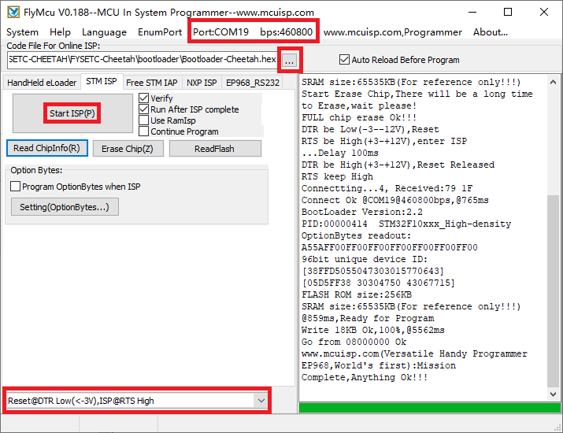

# Firmware

We use `Cheetah v1.2` motherboard for our `Voron-0` kit. And we use `Klipper` firmware. You can get the pre-build firmwares and `printer.cfg` files beside this `README` file. 

## How to flash 

Well, i don't recommend you to use our pre-build firmwares as klipper firmware always update. I recommend you to compile klipper yours, follow it [here](https://www.klipper3d.org/Installation.html). The prebuild firmwares below just for beginners.

You should power up Cheetah board with 12v/24v power supply first.

### klipper.bin

If you use our pre-build `klipper.bin` firmware, you can flash the firmware with the command below. This command is also for those who compile klipper yourself, but you need to `cd ~/klpper/out` first. Remember to connect RaspberryPi with usb cable to Cheetah.

```
stm32flash -w klipper.bin -v -i rts,-dtr,dtr /dev/ttyUSB0
```

### klipper.hex

This is our pre-build firmware in hex format, you can flash it in windows system. 

You can follow the following steps to upload the bootloader.

- Download the flash software in our github https://github.com/FYSETC/STM32Flasher
- Power the board with power supply and connect the board to your PC with USB cable
- Double the click "FlyMcu.exe" software

[](https://github.com/FYSETC/FYSETC-Cheetah/blob/master/images/Flymcu.png)

- Select `Reset@DTR low(<-3v),ISP @RTS High`
- Click "Port" to select the port of your USB
- Select `Bootloader-STM32F103.hex` in the `Code File For Online ISP:` edit box. There is bootloader file named `Bootloader-STM32F103.hex` beside this `README` file.
- At last, click `Start ISP(p)` button to upload the firmware.
